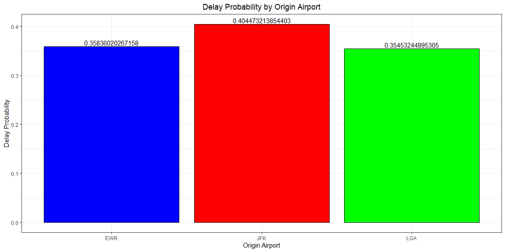
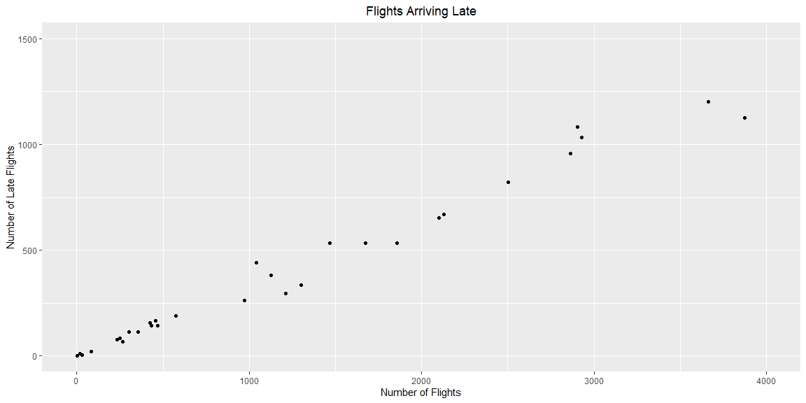

```r
# Use this R-Chunk to import all your datasets!
```

## Background

Hypothetical Situation:

Working as an intern for a large firm in New York, my boss has given me data on New York flights and has asked me to answer the following questions for him:

1. Which origin airport has the lowest probability of a late arrival when I am using Delta Airlines?
2. Which destination airport is the worst for flights arriving on time?

The following representation of the data answers these questions.

## Data Wrangling

Here, since my boss is only interested in Delta airlines, I removed data on other airlines so that everything seen here is according to Delta. Using the data provided, I also added probabilities on delays of departure and arrivals at each airport for better comparison. 

```r
# Use this R-Chunk to clean & wrangle your data!
flights1 <- filter(flights, carrier == "DL")
flights2 <- flights1 %>% 
  group_by(origin) %>% 
  summarise(numflight = n(),
            late = sum(dep_delay >= 0, na.rm = TRUE),
            late_prob = late / numflight)
flights2[2] <- NULL
flights2[2] <- NULL

flights3 <- flights1 %>% 
  group_by(dest) %>% 
  summarise(numflight = n(),
            late = sum(arr_delay > 0, na.rm = TRUE),
            late_prob = late / numflight)
flights3 <- filter(flights3, late_prob != 0) %>% 
  arrange(late_prob)

flights_over_1k <- filter(flights3, numflight > 1000)
flights_over_1k[2] <- NULL
flights_over_1k[2] <- NULL
```

## Data Visualization

To answer the first question, we can see from the plot below the 3 origin airports and their probabilities of having a flight leave later than it's scheduled time. As seen, LGA has the lowest probability, with EWR almost the same. JFK should be avoided if possible.

```r
# Use this R-Chunk to plot & visualize your data!
ggplot(flights2, aes(x = origin, y = late_prob, fill = origin)) +
  geom_col(color = "black") +
  theme_bw() +
  theme(legend.position = "none") +
  labs(x = "Origin Airport",
       y = "Delay Probability") +
  ggtitle("Delay Probability by Origin Airport") +
  theme(plot.title = element_text(hjust = 0.5)) +
  geom_text(aes(label=late_prob), position=position_dodge(width=0.9), vjust=-0.25) +
  scale_fill_manual(values=c("blue", "red", "green"))
```

<!-- -->

```r
# colnames(flights2) <- c("Origin Airport", "Probability of a \n Flight Being Delayed")
# pander(flights2)
```


To answer the second quesiton, this first plot shows us a few things. First of all, we see that there are many airports that have very few flights arriving from any of our origin airports. We also see a linear relationship between the number of arriving flights and the number of flights that arrive late. This is not suprising.

```r
ggplot(flights3, aes(x = numflight, y = late)) +
  geom_point() +
  xlim(0, 4000) +
  ylim(0, 1500) +
  labs(x = "Number of Flights",
       y = "Number of Late Flights") +
  ggtitle("Flights Arriving Late") +
  theme(plot.title = element_text(hjust = 0.5))
```

<!-- -->

It will not be very useful to use data from destination airports that will be unlikely to receive many flights. Because of this, the table below show all airports that received at least 1000 flights and their probabilities of having a late arrival.

```r
colnames(flights_over_1k) <- c("Destination", 
                               "Probability of a \n Flight Arriving Late")
pander(flights_over_1k)
```


-----------------------------------------
 Destination   Probability of a   Flight 
                     Arriving Late       
------------- ---------------------------
     SEA                0.2432           

     SJU                0.2567           

     SFO                0.2879           

     DTW                0.2906           

     SLC                0.3102           

     TPA                0.3138           

     LAS                0.3198           

     LAX                0.3279           

     MCO                0.3279           

     MSP                0.3341           

     MSY                0.3384           

     MIA                 0.353           

     PBI                0.3643           

     FLL                0.3724           

     ATL                 0.403           

     DEN                0.4219           
-----------------------------------------

## Conclusions
Based on the information gathered from the data, when flying Delta, try to avoid flying out of JFK, as it is the most likely to have flight delays. For deciding where to fly into, use the table to see which destination airports should be avoided, and which are more likely to get you in on time. Statistically, Atlanta is the worst airport in terms of arrival time. 
