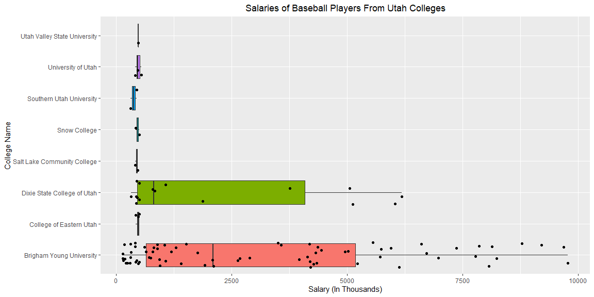

```r
# Use this R-Chunk to import all your datasets!
```

## Background

Over the campfire, you and a friend get into a debate about which college in Utah has had the best MLB success. As an avid BYU fan, you want to prove your point, and you go to data to settle the debate. You need a clear visualization that depicts the performance of BYU players compared to other Utah college players that have played in the major leagues. The library(Lahman) package has a comprehensive set of baseball data. It is great for testing out our relational data skills. We will also need a function to adjust player salaries due to inflation- library(blscrapeR).

## Data Wrangling


```r
# Use this R-Chunk to clean & wrangle your data!
inflate <- inflation_adjust(2020) %>% 
  mutate(year = as.character(year))

college <- Schools %>% 
  filter(state == "UT")
college <- Schools %>% 
  filter(state == "UT") %>% 
  left_join(CollegePlaying, by = "schoolID")
college <- college %>% 
  distinct(schoolID, name_full, city, playerID)


full_name <- People %>% 
  select(playerID, nameFirst, nameLast)


salary <- Salaries %>% 
  mutate(year = as.character(yearID)) %>% 
  select(playerID, salary, year)


main <- college %>% 
  left_join(full_name)


main <- main %>% 
  left_join(salary) %>% 
  left_join(inflate, by = "year")

player <- main %>% 
  mutate(infl_adjusted_sal = (salary / adj_value) / 1000) %>% 
  select(name_full, nameFirst, nameLast, infl_adjusted_sal)
player <- na.omit(player)


salary_by_school <- player %>% 
  group_by(name_full) %>% 
  summarise(mean_sal = mean(infl_adjusted_sal) * 1000)
```

## Data Visualization


```r
# Use this R-Chunk to plot & visualize your data!
ggplot(player, aes(y = name_full, x = infl_adjusted_sal, fill = name_full)) +
  geom_boxplot() +
  labs(x = "Salary (In Thousands)",
       y = "College Name",
       title = "Salaries of Baseball Players From Utah Colleges") +
  geom_jitter() +
  theme(plot.title = element_text(hjust = 0.5)) +
  theme(legend.position = "none")
```

<!-- -->

```r
pander(salary_by_school)
```


-----------------------------------------
          name_full             mean_sal 
------------------------------ ----------
   Brigham Young University     3193820  

   College of Eastern Utah       464172  

 Dixie State College of Utah    2111885  

 Salt Lake Community College     439454  

         Snow College            456603  

   Southern Utah University      374689  

      University of Utah         475377  

 Utah Valley State University    479310  
-----------------------------------------


