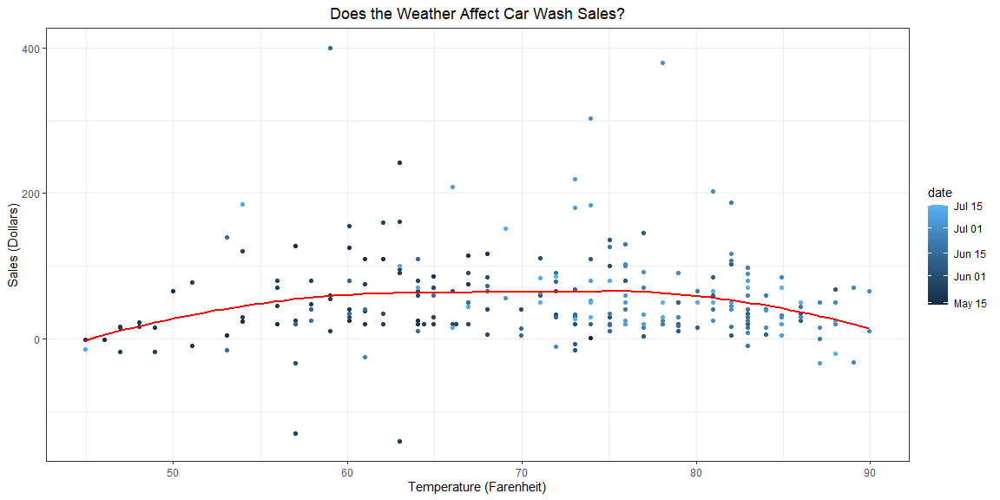

```r
# Use this R-Chunk to import all your datasets!
wash <- read_csv("https://byuistats.github.io/M335/data/carwash.csv")
```

## Background

How does the weather affect car wash sales?

## Data Wrangling


```r
# Use this R-Chunk to clean & wrangle your data!
wash1 <- wash %>% 
  mutate(date = with_tz(wash$time, tzone = "MST"))

wash2 <- wash1 %>% 
  mutate(date = ceiling_date(wash1$date, "hour"))

wash3 <- wash2 %>% 
  group_by(date) %>% 
  summarise(total = sum(amount))

data <- riem_measures(station = "RXE", date_start = "2016-05-13", date_end = "2016-07-18")


data1 <- data %>% 
  mutate(date = ceiling_date(data$valid, "hour"))

hour <- left_join(wash3, data1)


hour1 <- hour %>% 
  select(date, total, tmpf, valid) %>% 
  group_by(date) %>% 
  distinct(date, total, tmpf) %>% 
  na.omit()
```

## Data Visualization


```r
# Use this R-Chunk to plot & visualize your data!
ggplot(hour1, aes(x = tmpf, y = total, color = date)) +
  geom_point() +
  geom_smooth(fill = NA, color = "red") +
  theme_bw() +
  labs(x = "Temperature (Farenheit)",
       y = "Sales (Dollars)",
       title = "Does the Weather Affect Car Wash Sales?") +
  theme(plot.title = element_text(hjust = 0.5))
```

<!-- -->

## Conclusions

Based on the data and visualization, a temperature between 70-80 degrees Fahrenheit yields the highest car wash sales numbers. On days that are very cold or very hot, sales are lower.
