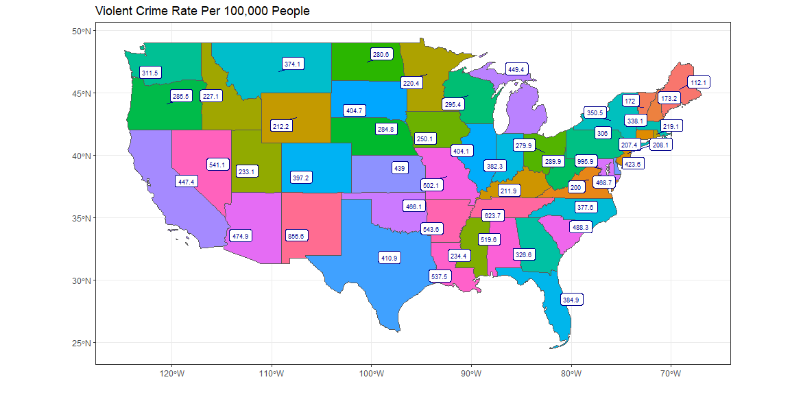
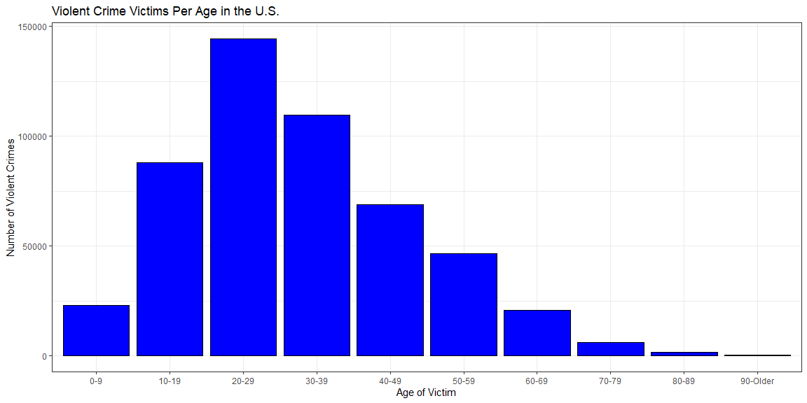
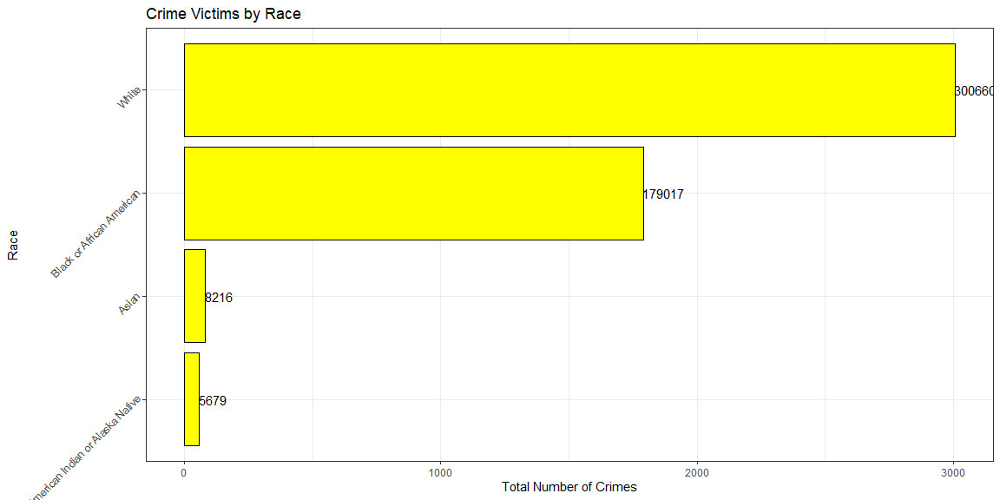

```r
# Use this R-Chunk to import all your datasets!
victim_sex <- read.csv("C:\\Users\\clayt\\OneDrive\\Documents\\Math 335\\victim-sex-2019.csv")

victim_race <- read.csv("C:\\Users\\clayt\\OneDrive\\Documents\\Math 335\\victim-race-2019.csv")

victim_age <- read.csv("C:\\Users\\clayt\\OneDrive\\Documents\\Math 335\\victim-age-2019.csv")

us_crime <- read.csv("C:\\Users\\clayt\\OneDrive\\Documents\\Math 335\\united-states-violent-crime.csv")

state_crime <- read.csv("C:\\Users\\clayt\\OneDrive\\Documents\\Math 335\\table-4.csv")

location <- read.csv("C:\\Users\\clayt\\OneDrive\\Documents\\Math 335\\location-type-2019.csv")
```

## Background

Most people have one or two places they want to live and establish themselves. A phrase that I hear a lot when talking about where to live is, "I think that would be a good place to raise a family". What does that mean? What makes a city a suitable place to raise a family? If you had to choose 3 things, most people would say safety is something that makes a city/state a good place to raise a family. 

I have taken crime data from various sources including multiple government websites and the FBI. All of the data analyzed will be on violent crimes committed as recent as 2018. These crimes include murder, rape, robbery, aggravated assault, property crime, burglary, larceny, and vehicle theft. Rather than splitting up each of these offenses, we will look at the overall rate of crime. We will go a step further and look at what type of people are most likely to be a victim of such crimes. Based on these demographic comparisons, I believe anyone will be able to make a well informed decision on what area of the United States is safest for them to live.

## Data Wrangling


```r
# Use this R-Chunk to clean & wrangle your data!
location <- location[order(location$Value, decreasing = TRUE),]

state_crime1 <- state_crime %>% 
  filter(Year == "2018",
         Area != c("United States", "New England", "Northeast", "Middle Atlantic",
         "Midwest", "East North Central", "West North Central", "South", "South Atlantic",
         "East South Central", "West South Central", "West", "Mountain", "Pacific", "Puerto Rico")) %>%
  mutate(name = Area) %>% 
  select(name, Year, Population2, Violent.crime3, X)
  
victim_sex <- victim_sex %>% 
  filter(Key != "Unknown")

victim_race <- victim_race %>% 
  filter(Key != "Unknown",
         Key != "Native Hawaiian")

victim_age <- victim_age %>% 
  filter(Key != "Unknown")

us_map <- us_states()
us_map <- us_map %>% 
  mutate(state = as.numeric(statefp))

joined_data <- state_crime1 %>% 
  left_join(us_map, by = "name") %>% 
  filter(name != "Alaska",
         name != "Hawaii",
         name != "Puerto Rico")

table1 <- joined_data %>% 
  select(name, Population2, Violent.crime3, X) %>% 
  mutate(ViolentCrimeRate = X,
         TotalCrime = Violent.crime3,
         Population = Population2) %>% 
  select(name, ViolentCrimeRate, Population, TotalCrime)
  
table1 <- table1[order(table1$name),]
```

## Data Visualization

The following plot shows the crime rate per 100,000 people in each state. This measurement gives a fair comparison of each state and the level of crime present in each. 


```r
# Use this R-Chunk to plot & visualize your data!
ggplot(joined_data) +
  geom_sf(data = joined_data$geometry, aes(fill = joined_data$X)) +
  geom_label_repel(data = joined_data, aes(geometry = geometry, label = joined_data$X),
                   stat = "sf_coordinates",
                   color = "blue4",
                   size = 2.3) +
  theme_bw() +
  theme(legend.position = "none") +
  labs(x = "",
       y = "",
       title = "Violent Crime Rate Per 100,000 People")
```

<!-- -->

For a more specific look at all of the states, a table is provided with specific information on how each state compares.

```r
pander(table1)
```


----------------------------------------------------------------------------
 &nbsp;           name           ViolentCrimeRate   Population   TotalCrime 
-------- ---------------------- ------------------ ------------ ------------
 **31**         Alabama               519.6         4,887,871      25,399   

 **39**         Arizona               474.9         7,171,646      34,058   

 **35**         Arkansas              543.6         3,013,825      16,384   

 **47**        California             447.4         39,557,045    176,982   

 **40**         Colorado              397.2         5,695,564      22,624   

 **1**        Connecticut             207.4         3,572,665      7,411    

 **22**         Delaware              423.6          967,171       4,097    

 **23**   District of Columbia        995.9          702,455       6,996    

 **24**         Florida               384.9         21,299,325     81,980   

 **25**         Georgia               326.6         10,519,475     34,355   

 **41**          Idaho                227.1         1,754,208      3,983    

 **10**         Illinois              404.1         12,741,080     51,490   

 **11**         Indiana               382.3         6,691,878      25,581   

 **15**           Iowa                250.1         3,156,145      7,893    

 **16**          Kansas                439          2,911,505      12,782   

 **32**         Kentucky              211.9         4,468,402      9,467    

 **36**        Louisiana              537.5         4,659,978      25,049   

 **2**           Maine                112.1         1,338,404      1,501    

 **26**         Maryland              468.7         6,042,718      28,320   

 **3**       Massachusetts            338.1         6,902,149      23,337   

 **12**         Michigan              449.4         9,995,915      44,918   

 **17**        Minnesota              220.4         5,611,179      12,369   

 **33**       Mississippi             234.4         2,986,530      6,999    

 **18**         Missouri              502.1         6,126,452      30,758   

 **42**         Montana               374.1         1,062,305      3,974    

 **19**         Nebraska              284.8         1,929,268      5,494    

 **43**          Nevada               541.1         3,034,392      16,420   

 **4**       New Hampshire            173.2         1,356,458      2,349    

 **7**         New Jersey             208.1         8,908,520      18,537   

 **44**        New Mexico             856.6         2,095,428      17,949   

 **8**          New York              350.5         19,542,209     68,495   

 **27**      North Carolina           377.6         10,383,620     39,210   

 **20**       North Dakota            280.6          760,077       2,133    

 **13**           Ohio                279.9         11,689,442     32,723   

 **37**         Oklahoma              466.1         3,943,079      18,380   

 **48**          Oregon               285.5         4,190,713      11,966   

 **9**        Pennsylvania             306          12,807,060     39,192   

 **5**        Rhode Island            219.1         1,057,315      2,317    

 **28**      South Carolina           488.3         5,084,127      24,825   

 **21**       South Dakota            404.7          882,235       3,570    

 **34**        Tennessee              623.7         6,770,010      42,226   

 **38**          Texas                410.9         28,701,845    117,927   

 **45**           Utah                233.1         3,161,105      7,368    

 **6**          Vermont                172           626,299       1,077    

 **29**         Virginia               200          8,517,685      17,032   

 **49**        Washington             311.5         7,535,591      23,472   

 **30**      West Virginia            289.9         1,805,832      5,236    

 **14**        Wisconsin              295.4         5,813,568      17,176   

 **46**         Wyoming               212.2          577,737       1,226    
----------------------------------------------------------------------------

The plot below allows us to see what age groups are most likely to be victims of violent crimes.

```r
ggplot() +
  geom_col(data = victim_age, aes(x = victim_age$Key, y = victim_age$Value),
                                  fill = "blue", color = "black") +
  theme_bw() +
  labs(x = "Age of Victim",
       y = "Number of Violent Crimes",
       title = "Violent Crime Victims Per Age in the U.S.")
```

<!-- -->

This next plot breaks down how crime victims compare based on race.

```r
ggplot(victim_race, aes(y = Key, x = Value/100)) +
  geom_col(fill = "yellow", color = "black") +
  geom_text(aes(label = Value), hjust = 0.01, 
            position=position_dodge(width=0.9), size=4) +
  theme_bw() +
  labs(x = "Total Number of Crimes",
       y = "Race",
       title = "Crime Victims by Race") +
  scale_y_discrete(guide = guide_axis(angle = 45))
```

<!-- -->

The comparison of male and female victims are very close. The below table shows how males tend to victims a little more than females.

```r
pander(victim_sex)
```


---------------------------
  Key     Value    Percent 
-------- -------- ---------
  Male    261372   0.5075  

 Female   251465   0.4882  
---------------------------

It is also interesting to note where such crimes occur. The provided table tells us which locations these crimes most occur.

```r
pander(location)
```


--------------------------------------------------
 &nbsp;              Location              Value  
-------- -------------------------------- --------
 **2**            Residence Home           263971 

 **26**   Highway/Alley/Street/Sidewalk    101020 

 **3**          Parking Garage/Lot         34618  

 **33**              Unknown               16197  

 **46**         Convenience Store          15588  

 **37**             Restaurant             10309  

 **27**            Hotel/Motel             10055  

 **18**     Department/Discount Store       9500  

 **41**            Gas Station              8615  

 **10**           Bar/Nightclub             6971  

 **34**          Park/Playground            6109  

 **40**    School Elementary/Secondary      5426  

 **44**          Specialty Store            5414  

 **13**     Commercial/Office Building      5280  

 **25**           Grocery Store             4723  

 **20**         Drug Store/Doctors          4670  
                 Office/Hospital                  

 **22**            Field/Woods              4423  

 **29**      Jail/Prison/Corrections        3649  
                     Facility                     

 **1**                 Bank                 2860  

 **24**     Government/Public Building      2172  

 **5**        Air/Bus/Train Terminal        1760  

 **38**           School/College            1288  

 **43**           Shopping Mall             1175  

 **31**            Liquor Store             1162  

 **39**     School College/University       1103  

 **12**   Church/Synagogue/Temple/Mosque    886   

 **23**   Gambling Facility/Casino/Race     552   
                      Track                       

 **42**      Mission/Homeless Shelter       523   

 **11**             Campground              497   

 **35**      Rental Storage Facility        469   

 **30**        Lake/Waterway/Beach          439   

 **15**         Construction Site           383   

 **14**          Community Center           358   

 **4**    Abandoned Condemned/Structure     344   

 **17**          Daycare Facility           296   

 **28**          Industrial Site            252   

 **9**           Auto Dealership            242   

 **36**             Rest Area               223   

 **7**      Arena/Stadium/Fairgrounds       194   

 **8**        ATM Separate From Bank        145   

 **6**            Amusement Park            121   

 **21**           Farm Facility              95   

 **19**    Dock/Wharf/Shipping Terminal      84   

 **45**            Tribal Lands              20   

 **32**           Military Base              15   

 **16**             Cyberspace               0    
--------------------------------------------------

## Conclusions

Based on the information provided, there are certainly some states that are historically safer than others. Typically, the more densely populated areas have more crime. Based on the demographic data, white males between the age of 20 and 40 tend to be victims of these crimes more often than anyone else. 


