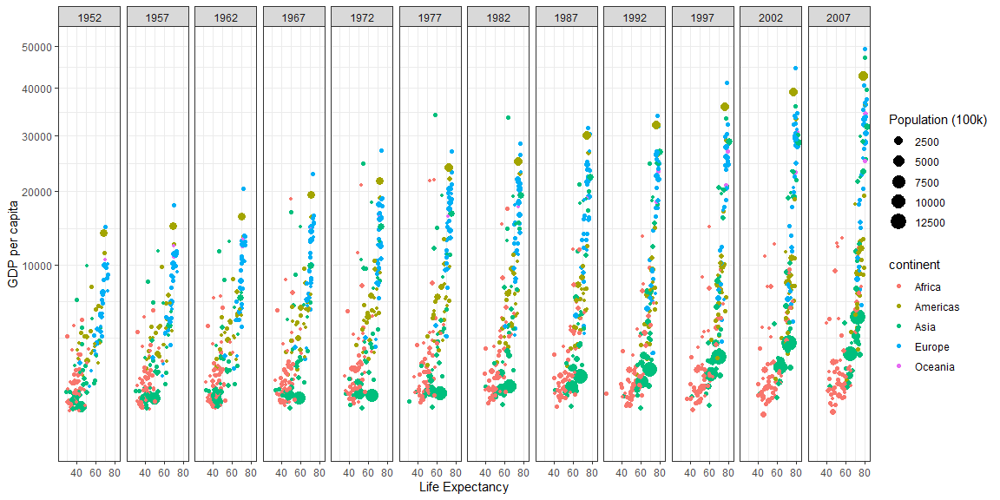
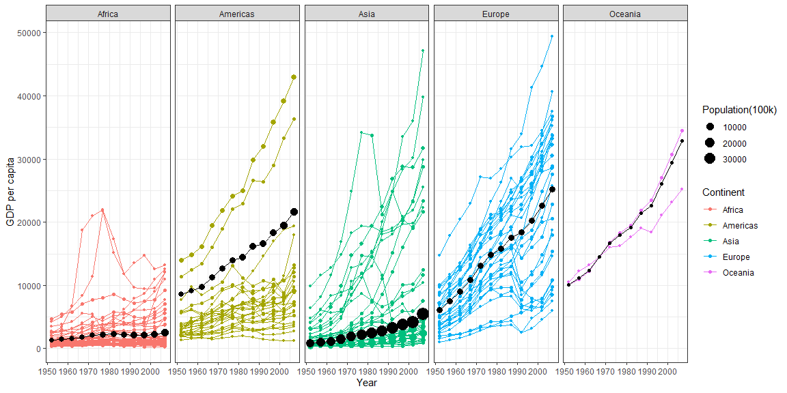

## Background

A couple of graphs I made in ggplot using dplyr and Gapminder to analyze wealth and life expectancy in different regions of the world.

'''
<!-- ## Data Wrangling -->


## Data Visualization, Images


```r
# Use this R-Chunk to plot & visualize your data!

gapminder1 <- filter(gapminder, country != "Kuwait")
gapminder2 <- gapminder1 %>% 
  mutate(pop1 = pop / 100000)


ggplot(data = gapminder2, aes(x = lifeExp, y = gdpPercap, size = pop1,
                             color = continent)) +
  geom_point() +
    guides(size = guide_legend(order=1),
           color = guide_legend(order=2)) +
  coord_cartesian(ylim = c(0, 50000)) +
  labs(x = "Life Expectancy",
       y = "GDP per capita",
       size = "Population (100k)") +
  scale_y_continuous(trans = "sqrt") +
  facet_grid(. ~ year) +
  theme_bw()
```

<!-- -->

```r
# ggsave("CaseStudy2Plot.png",
#        width = 15)
```


```r
ggplot(data = gapminder1, aes(x = year, y = gdpPercap, color = continent)) +
  
  geom_line(aes(group = country)) +
  geom_point(aes(size = pop/100000)) +
  
  geom_point(data = weightmean, aes(y = w_mean, size = total/100000), color = "black") +
  geom_line(data = weightmean, aes(y = w_mean), color = "black") +
  
  facet_grid(. ~ continent) +
  labs(y = "GDP per capita", 
       x = "Year", 
       size = "Population(100k)",
       color = "Continent") +
  theme_bw()
```

<!-- -->


<!-- ## Conclusions -->
