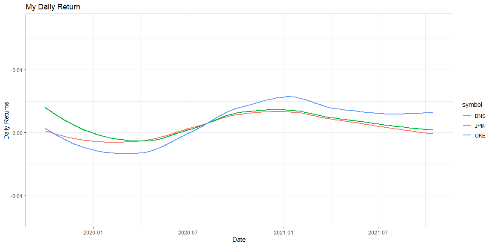
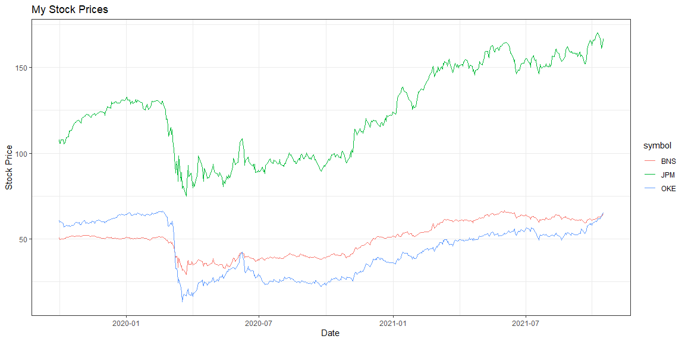
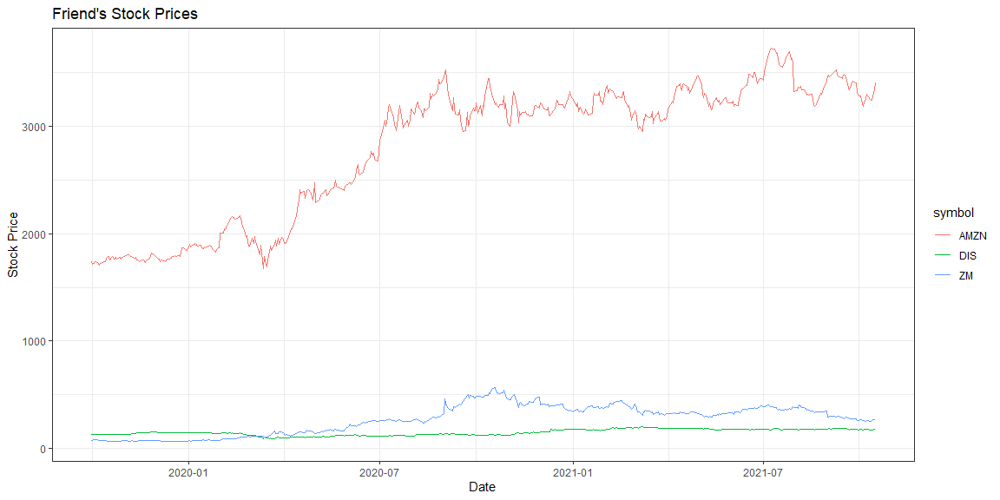
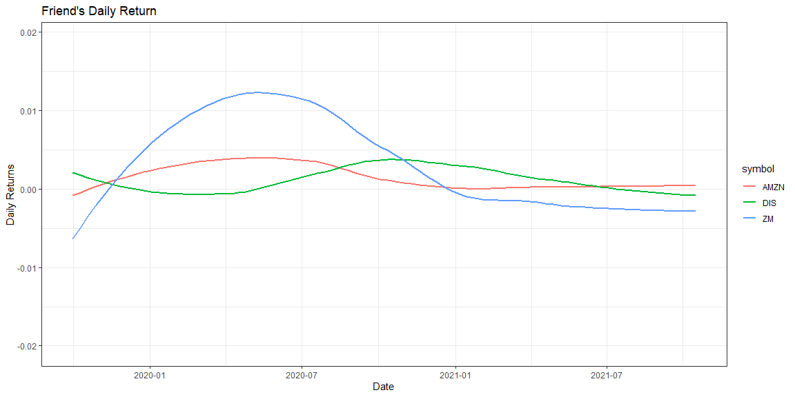
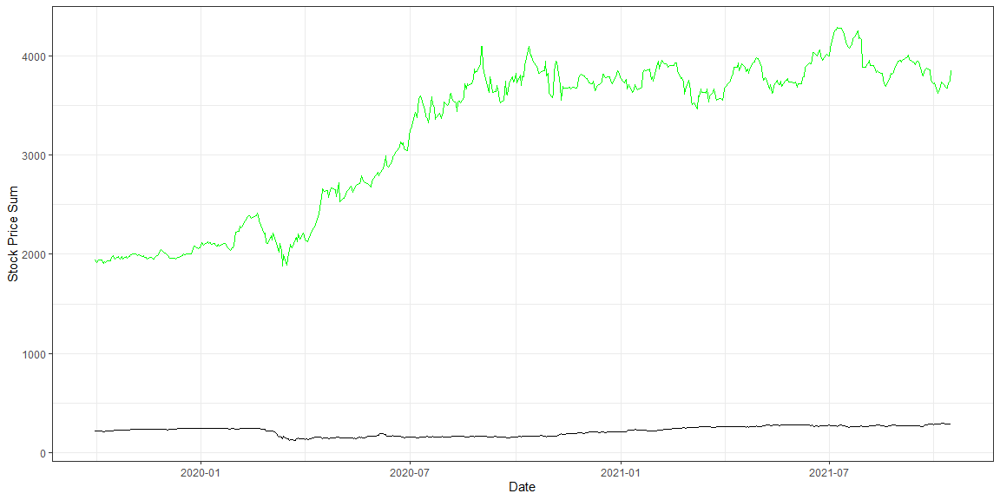
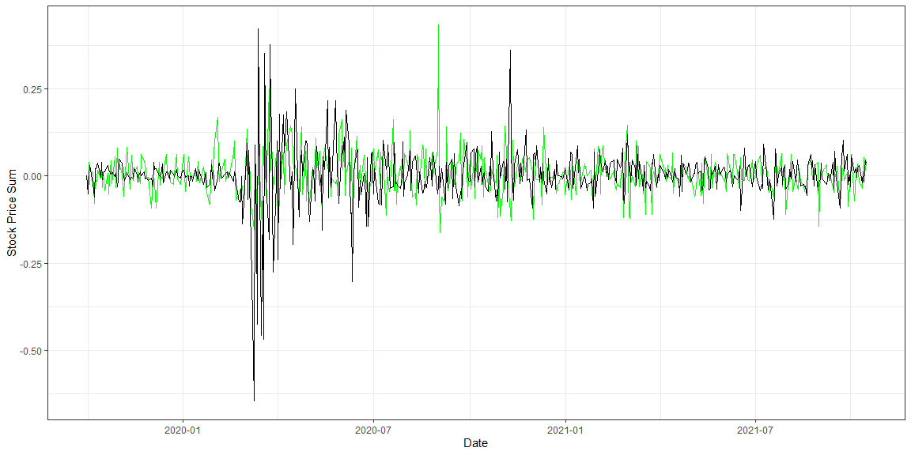

```r
# Use this R-Chunk to import all your datasets!
```

## Background

Hypothetical situation:

The stock market is overflowing with data. There are many packages in R that allow us to get quick access to information on publicly traded companies. Imagine that you and a friend each purchased about $1,000 of stock in three different stocks at the start of October last year, and you want to compare your performance up to this week. Use the stock shares purchased and share prices to demonstrate how each of you fared over the period you were competing (assuming that you did not change your allocations).

## Data Wrangling


```r
# Use this R-Chunk to clean & wrangle your data!
my_stocks <- c("BNS", "JPM", "OKE")
friend_stocks <- c("ZM", "AMZN", "DIS")

my_prices <- tq_get(my_stocks,
                     get = "stock.prices",
                     from = "2019-10-01")

friend_prices <- tq_get(friend_stocks,
                    get = "stock.prices",
                    from = "2019-10-01")

my_return <- my_prices %>% 
  group_by(symbol) %>% 
  tq_transmute(select = adjusted,
               mutate_fun = periodReturn,
               period = "daily",
               type = "arithmetic")

friend_return <- friend_prices %>% 
  group_by(symbol) %>% 
  tq_transmute(select = adjusted,
               mutate_fun = periodReturn,
               period = "daily",
               type = "arithmetic")

me <- my_prices %>% 
  group_by(date) %>% 
  summarise(total = sum(adjusted))

friend <- friend_prices %>% 
  group_by(date) %>% 
  summarise(total = sum(adjusted))

me1 <- my_return %>% 
  group_by(date) %>% 
  summarise(total = sum(daily.returns))

friend1 <- friend_return %>% 
  group_by(date) %>% 
  summarise(total = sum(daily.returns))
```

## Data Visualization

My stock performance: 

```r
# Use this R-Chunk to plot & visualize your data!
# My daily return
ggplot(my_return, aes(x = date, y = daily.returns, color = symbol)) +
  geom_smooth(fill = NA) +
  theme_bw() +
  labs(x = "Date",
       y = "Daily Returns",
       title = "My Daily Return",
       legend = "Stock")
```

<!-- -->

```r
# My Stock Prices
ggplot(my_prices, aes(x = date, y = adjusted, color = symbol)) +
  geom_line(fill = NA) +
  theme_bw() +
  labs(x = "Date",
       y = "Stock Price",
       title = "My Stock Prices",
       legend = "Stock")
```

<!-- -->


My friend's stock performance:

```r
# Friend's Stock Price Change
ggplot(friend_prices, aes(x = date, y = adjusted, color = symbol)) +
  geom_line(fill = NA) +
  theme_bw() +
  labs(x = "Date",
       y = "Stock Price",
       title = "Friend's Stock Prices",
       legend = "Stock")
```

<!-- -->

```r
# Friend's Daily Return
ggplot(friend_return, aes(x = date, y = daily.returns, color = symbol)) +
  geom_smooth(fill = NA) +
  theme_bw() +
  labs(x = "Date",
       y = "Daily Returns",
       title = "Friend's Daily Return",
       legend = "Stock")
```

<!-- -->


Comparison:

```r
ggplot(friend, aes(x = date, y = total)) +
  geom_line(color = "green") +
  geom_line(data = me) +
  theme_bw() +
  labs(x = "Date",
       y = "Stock Price Sum")
```

<!-- -->

```r
ggplot(friend1, aes(x = date, y = total)) +
  geom_line(color = "green") +
  geom_line(data = me1) +
  theme_bw() +
  labs(x = "Date",
       y = "Stock Price Sum")
```

<!-- -->

## Conclusions

Based on the sums of the total stock price of each portfolio, my friend seems to have done better than me, since the total increase in their stocks was much greater than mine.
