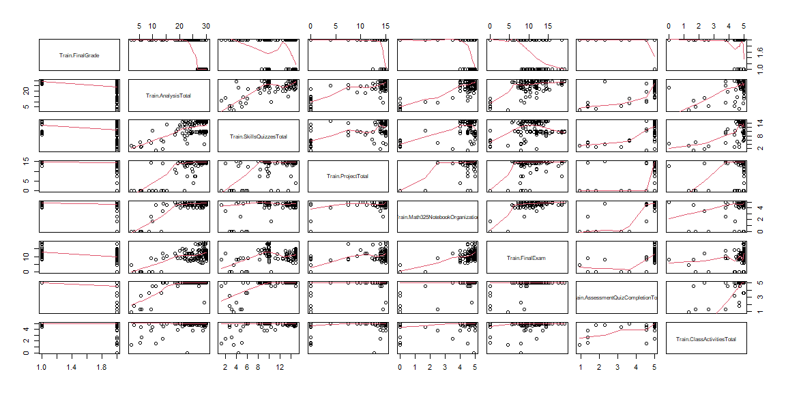
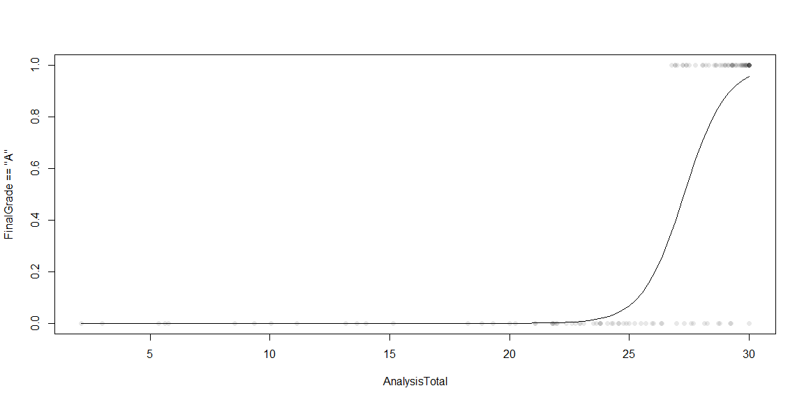

```r
# Use this R-Chunk to import all your datasets!
Train <- read.csv("C:/Users/clayt/Downloads/Math325Grades_Train.csv", stringsAsFactors=TRUE)
Test <- read.csv("C:/Users/clayt/Downloads/Math325Grades_Test-1.csv", stringsAsFactors=TRUE)
```

## Background

Given data on past grades for a particular course at the university, the objective is to predict how well a student will do in the course and whether or not they will earn an A based on their performance in certain aspects/assignments. More generally, which assignments throughout the semester historically show to be the most important relative to overall performance and final grade in the course?

## Data Wrangling


```r
# Use this R-Chunk to clean & wrangle your data!

data <- data.frame(Train$FinalGrade, Train$AnalysisTotal, Train$SkillsQuizzesTotal, Train$ProjectTotal, Train$Math325NotebookOrganization, Train$FinalExam, Train$AssessmentQuizCompletionTotal, Train$ClassActivitiesTotal)
pairs(data, panel=panel.smooth)
```

<!-- -->

```r
myglm2 <- glm(FinalGrade == "A" ~ AnalysisTotal, data=Train, family = binomial)
summary(myglm2)
```

```
## 
## Call:
## glm(formula = FinalGrade == "A" ~ AnalysisTotal, family = binomial, 
##     data = Train)
## 
## Deviance Residuals: 
##      Min        1Q    Median        3Q       Max  
## -2.50649  -0.16491  -0.00001   0.41607   1.43710  
## 
## Coefficients:
##               Estimate Std. Error z value Pr(>|z|)    
## (Intercept)   -31.1710     6.2806  -4.963 6.94e-07 ***
## AnalysisTotal   1.1423     0.2252   5.071 3.95e-07 ***
## ---
## Signif. codes:  0 '***' 0.001 '**' 0.01 '*' 0.05 '.' 0.1 ' ' 1
## 
## (Dispersion parameter for binomial family taken to be 1)
## 
##     Null deviance: 166.055  on 119  degrees of freedom
## Residual deviance:  62.879  on 118  degrees of freedom
## AIC: 66.879
## 
## Number of Fisher Scoring iterations: 8
```

```r
b <- coef(myglm2)


Train$FinalisA <- ifelse(Train$FinalGrade == "A", 1, 0)


hoslem.test(myglm2$y, myglm2$fitted.values)
```

```
## 
## 	Hosmer and Lemeshow goodness of fit (GOF) test
## 
## data:  myglm2$y, myglm2$fitted.values
## X-squared = 4.0444, df = 8, p-value = 0.8531
```

```r
n <- nrow(Train)
keep <- sample(1:120, 70)

mytrain <- Train[keep, ]
mytest <- Train[-keep, ]

glm.val <- glm(FinalGrade == "A" ~ AnalysisTotal, data=mytrain, family=binomial)

mypreds <- predict(glm.val, mytest, type="response")

whatIguessWillHappen <- ifelse(mypreds > 0.30, 1, 0)
```

I decided to perform a logistic regression to predict whether or not a student will receive an overall A in the course based on their total performance in the completing the analysis assignments. I think this is a valid way to predict their overall grade for a few reasons. First, the summary of the regression is promising. The p-values are significant and the AIC is not too terribly high. Second, looking at the graph below, there are no exceptions of anyone getting an A in the class while receiving less than about a 26 on the total analysis score. Some people do manage to not get an A in the class even though they did really well on the analyses, so you cannot expect to only focus on the analyses and still get an A. You must do relatively well in other aspects of the course as well. However, based on this data there is no chance of a student receiving an A in the course if they do not score around a 26 at least for the total analysis score. 

### Validation


```r
mytest$FinalisA
```

```
##  [1] 0 1 1 1 0 0 0 0 0 1 0 0 0 0 1 0 1 0 1 0 1 0 1 1 0 1 0 0 1 0 1 1 0 1 0 0 1 1
## [39] 1 1 1 1 0 1 1 1 0 0 0 0
```

```r
table(whatIguessWillHappen, mytest$FinalisA)
```

```
##                     
## whatIguessWillHappen  0  1
##                    0 22  0
##                    1  4 24
```

```r
#(25+20) / (25+3+2+20)
#(23+22) / (23+22+5+0)
pander((18+29) / (18+0+3+29))
```

_0.94_


## Data Visualization


```r
# Use this R-Chunk to plot & visualize your data!

plot(FinalGrade == "A" ~ AnalysisTotal, data=Train, pch=16, col=rgb(.1,.1,.1,.1))
#curve(exp(b[1] + b[2]*x + b[4]) / (1 + exp(b[1] + b[2]*x + b[4])), add=TRUE)

#curve(exp(b[1] + b[2]*x +b[3]) / (1 + exp(b[1] + b[2]*x + b[3])), add=TRUE) #glm3


curve(exp(b[1] + b[2]*x) / (1 + exp(b[1] + b[2]*x)), add=TRUE) #glm2
```

<!-- -->

```r
#curve(exp(b[1] + b[2]*x + b[3]) / (1 + exp(b[1] + b[2]*x + b[3])), add=TRUE) #glm2

#Analysis = 0
#curve(exp(b[1] + b[2]*AnalysisTotal + b[3]*Analysis) / (1 + exp(b[1] + b[2]*AnalysisTotal + b[3]*Analysis)), add=TRUE, xname="AnalysisTotal") #glm

#curve(exp(b[1] + b[2]*x + b[3]*x) / (1 + exp(b[1] + b[2]*x + b[3]*x)), add=TRUE)
```

## Conclusions

Based on this analysis, I would tell students that perhaps the most important thing they can do to get an A in Math 325 is resubmit their analyses until they get a perfect score or very close to it. Ideally, this will help their understanding of the concepts and allow them to do well on the other assignments in the course, but they still need to work hard to do well on the other assignments as well. Based on this data, it is still possible for them not to get an A in the course even if they do well on the analyses, but it is impossible for them to get an A if they do poorly on the analyses. As long as they resubmit their analyses until they get perfect scores, their chances of receiving an A in the course increase 


