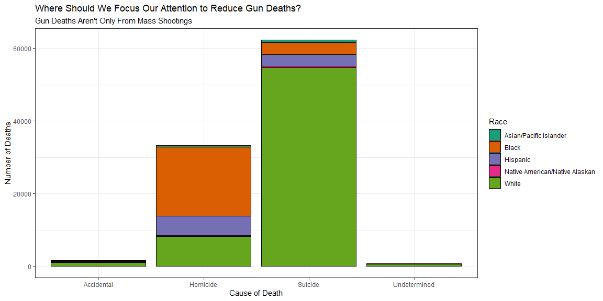
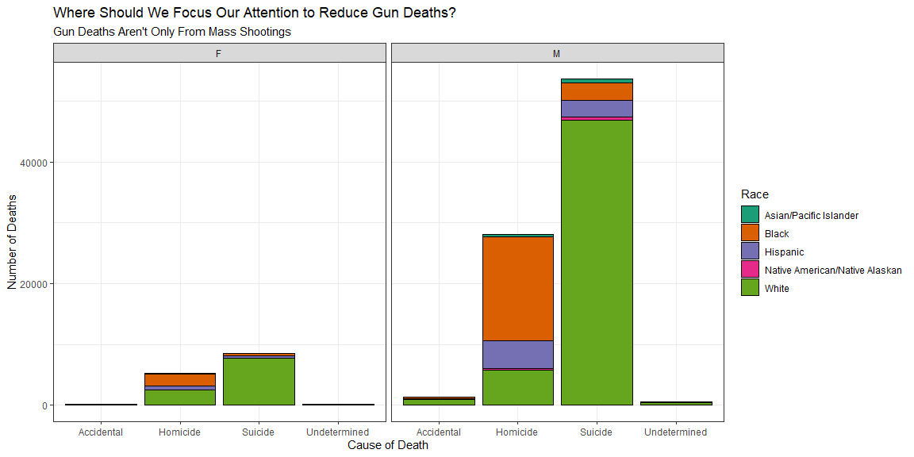
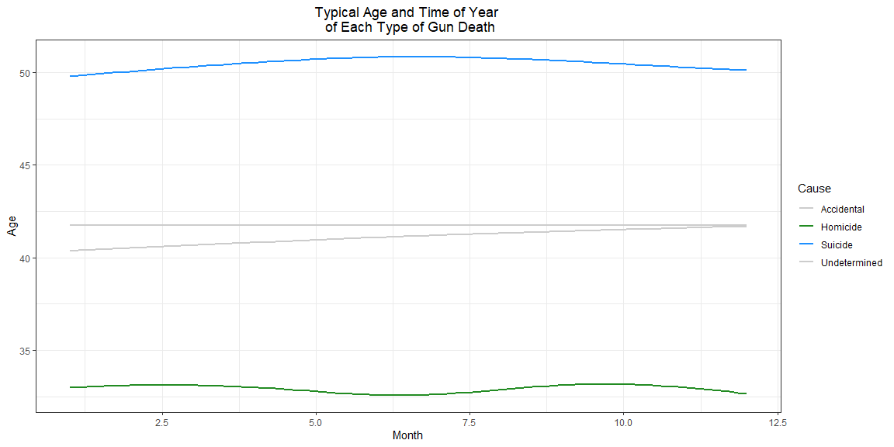

```r
# Use this R-Chunk to import all your datasets!
data <- read.csv(url("https://raw.githubusercontent.com/fivethirtyeight/guns-data/master/full_data.csv"))
```

## Background

The data discussed is from an article found here:

https://fivethirtyeight.com/features/gun-deaths/

The article breaks down the annual number of gun deaths in the United States by age, sex, race, and cause. It is very interesting to study this data and see the actuality of guns death causes rather than just what we hear in the media. The article mentions this. We tend to hear a lot about any mass shooting, police shooting, or terrorist shooting, but the data shows that almost two thirds of guns deaths each year are suicide. Why do we not hear more about this and focus on how to help reduce the number of suicides?

## Data Wrangling

Creating new columns for the seasons of the year and specific age groups

```r
# Use this R-Chunk to clean & wrangle your data!
data <- na.omit(data)

data1 <- data %>% 
  mutate(
    season = case_when(
      month %in% c(12,1,2) ~ "Winter",
      month %in% c(3,4,5) ~ "Spring",
      month %in% c(6,7,8) ~ "Summer",
      month %in% c(9,10,11) ~ "Fall",))

data1 <- data1 %>% 
  mutate(
    age_group = case_when(
      age %in% c(15:34) & sex == "M" ~ "Young Men \n Ages 15-34",
      age >= 15 & sex == "F" ~ "Women \n Age 15+",
      age > 34 & sex == "M" ~ "Older Men \n Age 35+"))
data1 <- na.omit(data1)

data_homicide <- data1 %>% 
  filter(intent == "Homicide") %>% 
  select(intent, season, age_group, race)

data_suicide <- data1 %>% 
  filter(intent == "Suicide") %>% 
  select(intent, season, age_group, race)

table_suic <- table(data_suicide$season, data_suicide$age_group)

table_homi <- table(data_homicide$season, data_homicide$age_group)
```

## Data Visualization

THe following plot gives an overall summary of the data and represents the biggest takeaways. As we can see, homicide and suicide are the main causes of gun deaths by a large margin. Also, suicides are most prevalent among the white population, while homicides are most common among the black community.

```r
# Use this R-Chunk to plot & visualize your data!
ggplot(data, aes(x = intent, fill = race)) +
  geom_bar(color = "black") +
  labs(x = "Cause of Death",
       y = "Number of Deaths",
       title = "Where Should We Focus Our Attention to Reduce Gun Deaths?",
       subtitle = "Gun Deaths Aren't Only From Mass Shootings",
       fill = "Race") +
  theme(plot.title = element_text(hjust = 0.5)) +
  theme(plot.subtitle = element_text(hjust = 0.5)) +
  theme_bw() +
  scale_fill_brewer(palette="Dark2")
```

<!-- -->


The following plot is a variation of the first one, but also tells us which gender suffers the most from gun violence. Males have an overwhelmingly greater number of gun deaths than females across all types.

```r
ggplot(data, aes(x = intent, fill = race)) +
  geom_bar(color = "black") +
  labs(x = "Cause of Death",
       y = "Number of Deaths",
       title = "Where Should We Focus Our Attention to Reduce Gun Deaths?",
       subtitle = "Gun Deaths Aren't Only From Mass Shootings",
       fill = "Race") +
  theme(plot.title = element_text(hjust = 0.5)) +
  theme(plot.subtitle = element_text(hjust = 0.5)) +
  theme_bw() +
  scale_fill_brewer(palette="Dark2") +
  facet_grid(. ~ sex)
```

<!-- -->

From the above plots, we see that suicide and homicide are the most common causes of gun deaths, the white and black communities suffer the most from gun violence, and males suffer more than women. Our target audience for commercials that will help reduce gun deaths is narrowing down! To make it even more precise, the graph below shows which age groups suffer the most from suicide and homicide, and what time of the year is most common for these deaths to occur:

```r
ggplot(data1, aes(x = month, y = age, color = intent)) +
  geom_smooth(se = FALSE) +
  scale_color_manual(values = c("Accidental" = "grey80",
                                "Undetermined" = "grey80",
                                "Suicide" = "dodgerblue1",
                                "Homicide" = "forestgreen")) +
  labs(x = "Month",
       y = "Age",
       title = "Typical Age and Time of Year \n of Each Type of Gun Death",
       color = "Cause") +
  theme_bw() +
  theme(plot.title = element_text(hjust = 0.5)) 
```

<!-- -->

To clarify a little more on the age groups and time of year, refer to the tables:


```r
pander(table_suic, caption = "Suicide Deaths By Season And Age Group")
```


-----------------------------------------------------------------------------
   &nbsp;     Older Men   Age 35+   Women   Age 15+   Young Men   Ages 15-34 
------------ --------------------- ----------------- ------------------------
  **Fall**           9876                2189                  3285          

 **Spring**          10418               2130                  3363          

 **Summer**          10499               2176                  3327          

 **Winter**          9454                2010                  3149          
-----------------------------------------------------------------------------

Table: Suicide Deaths By Season And Age Group

```r
pander(table_homi, caption = "Homicide Deaths By Season And Age Group")
```


-----------------------------------------------------------------------------
   &nbsp;     Older Men   Age 35+   Women   Age 15+   Young Men   Ages 15-34 
------------ --------------------- ----------------- ------------------------
  **Fall**           2359                1244                  4692          

 **Spring**          2170                1252                  4563          

 **Summer**          2417                1256                  5126          

 **Winter**          2093                1241                  4305          
-----------------------------------------------------------------------------

Table: Homicide Deaths By Season And Age Group

## Conclusions

During the summer and spring months, older, white males should be the target audience for suicide prevention. 

During the fall and winter months, younger, black males should be the target audience for prevention in homicide deaths.
