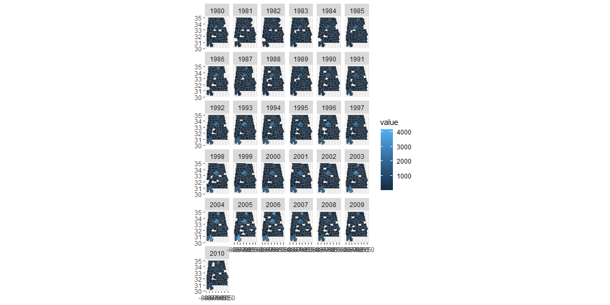
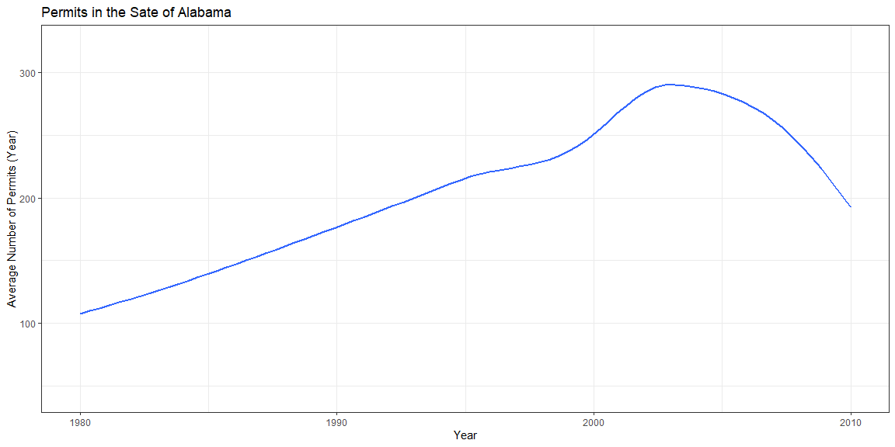
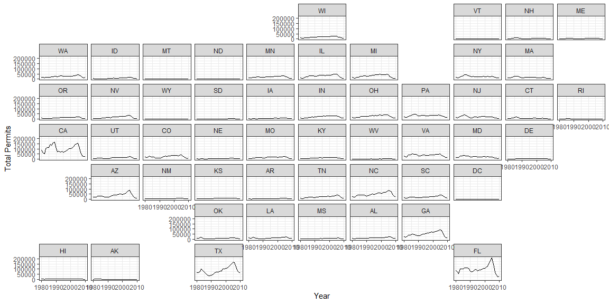

```r
# Use this R-Chunk to import all your datasets!
```

## Background

Hypothetical situation:

You have been asked to support a story for a local news website that looks back on the housing collapse of 2008 (Links to an external site.) and the early effects on residential construction. You have data on residential building permits from 1980 through 2010 for each county in the United States. Your colleague that is writing the article would like a few maps and graphics that highlight the single family building permit patterns across your state as well as the patterns in the US.

## Data Wrangling


```r
# Use this R-Chunk to clean & wrangle your data!
# MAP DATA

map_us <- us_states()

map_us <- map_us %>% 
  mutate(state = as.numeric(statefp))

map_alabama <- us_counties(states = "Alabama")

map_alabama <- map_alabama %>% 
  mutate(county = as.numeric(countyfp))


# PERMIT DATA

permits <- buildings::permits

permits_al <- permits %>% 
  filter(variable == "Single Family") %>% 
  filter(StateAbbr == "AL")

permits_us <- permits %>% 
  filter(variable == "Single Family") %>% 
  group_by(StateAbbr, year) %>% 
  mutate(total_permits = sum(value)) %>% 
  ungroup() %>% 
  distinct(StateAbbr, year, total_permits, state)

# MERGE DATA

alabama <- permits_al %>% 
  left_join(map_alabama) 

bama <- alabama %>% 
  group_by(year) %>% 
  summarise(av = mean(value))

us <- permits_us %>% 
  left_join(map_us)
```

## Data Visualization


```r
# Use this R-Chunk to plot & visualize your data!
ggplot(alabama) +
  geom_sf(aes(geometry = geometry, fill = value)) +
  facet_wrap(vars(year))
```

<!-- -->

```r
ggplot(bama, aes(x = year, y = av)) +
  geom_smooth(fill = NA) +
  theme_bw() +
  labs(x = "Year",
       y = "Average Number of Permits (Year)",
       title = "Permits in the Sate of Alabama")
```

<!-- -->

```r
ggplot(us, aes(x = year, y = total_permits)) +
  geom_line() +
  facet_geo(~ StateAbbr) +
  theme_bw() +
  labs(y = "Total Permits",
       x = "Year")
```

<!-- -->

