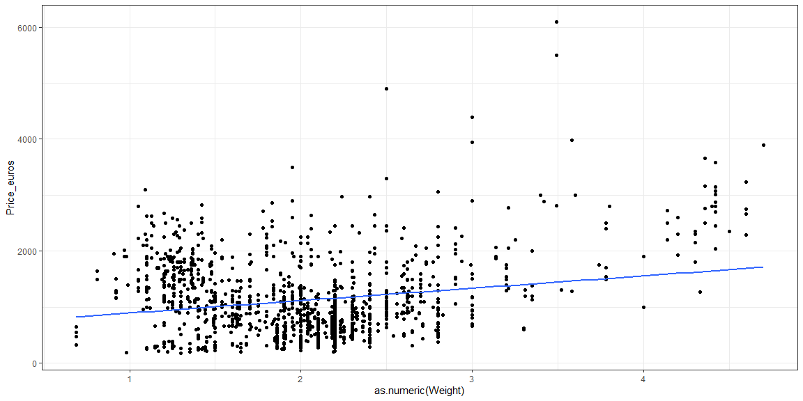
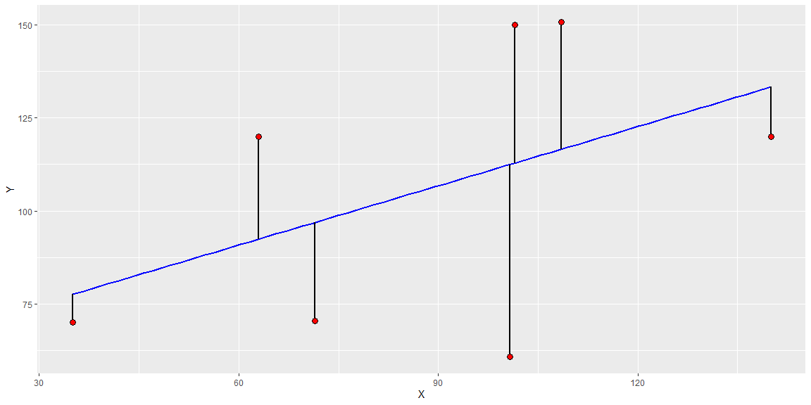
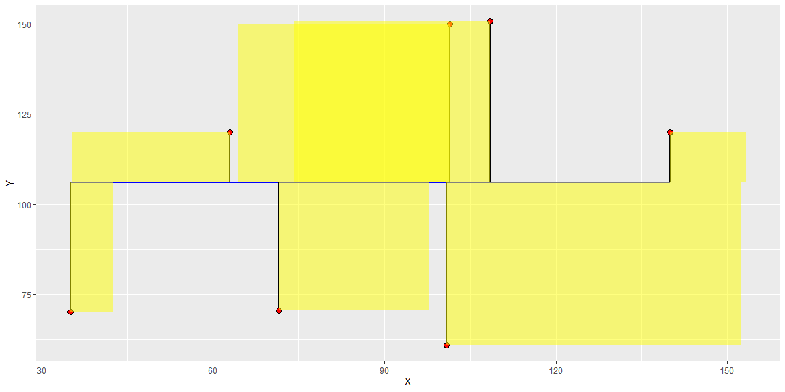
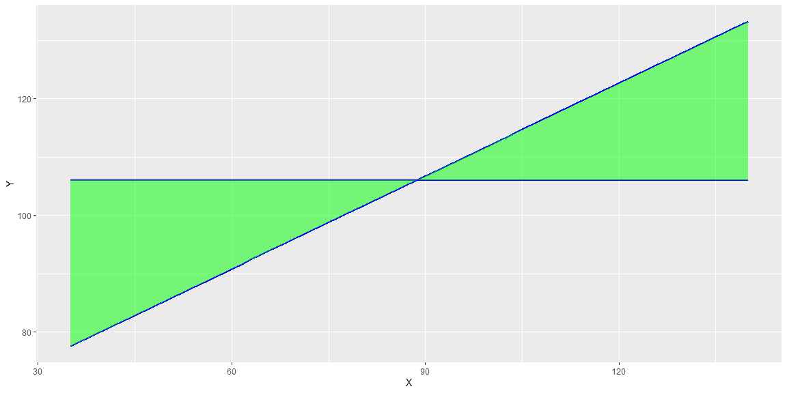
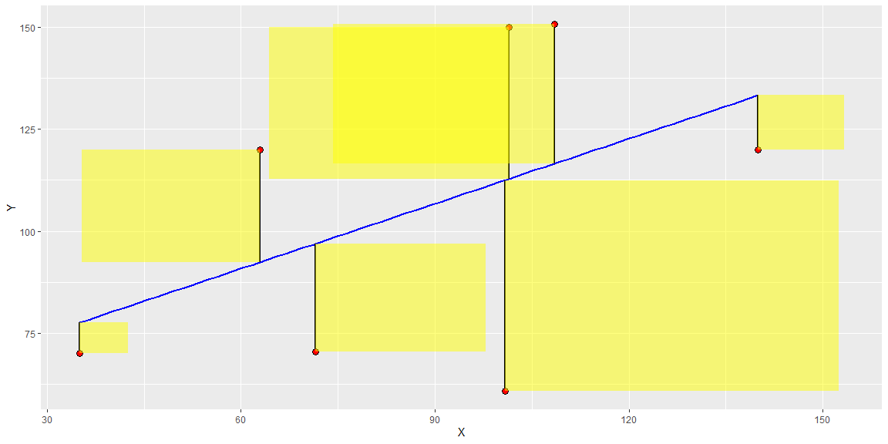
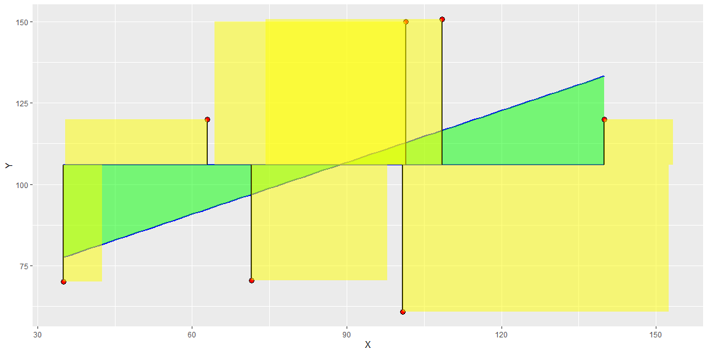

```r
# Use this R-Chunk to import all your datasets!
laptops <- read.csv("C:\\Users\\clayt\\OneDrive\\Documents\\Math 425\\laptops-1.csv")
```

## {.tabset .tabset-pills .tabset-fade}

### Part 1 - Laptop Data


#### Background

I will be using data on laptops to help explain the concepts that will be discussed.


```r
# Use this R-Chunk to clean & wrangle your data!
#laptops$Ram <- gsub('.{2}$', '', laptops$Ram) # Ram is in GB
laptops$Weight <- gsub('.{2}$', '', laptops$Weight)

#laptop.lm <- lm(laptops$Price_euros ~ laptops$Ram)
laptop_weight.lm <- lm(laptops$Price_euros ~ laptops$Weight)
#laptop_inches.lm <- lm(laptops$Price_euros ~ laptops$Inches)

SSE <- sum((laptop_weight.lm$residuals)^2)
SSR <- sum((laptop_weight.lm$fit-mean(laptops$Price_euros))^2)
SSTO <- sum((laptops$Price_euros-mean(laptops$Price_euros))^2)

laptop1 <- laptops %>% 
  filter(Weight == "2.5") %>% 
  filter(Company == "Lenovo") %>% 
  filter(Price_euros > 4000)
```

#### Data Visualization


```r
# Use this R-Chunk to plot & visualize your data!

#ggplot(laptops, aes(x=as.numeric(Ram), y=Price_euros)) +
#  geom_point() +
#  geom_smooth(method=lm, se=F)

ggplot(laptops, aes(x=as.numeric(Weight), y=Price_euros)) +
  geom_point() +
  geom_smooth(method=lm, se=F) +
  theme_bw()
```

<!-- -->

```r
#  geom_segment(data = laptop1, aes(x = Weight, y = Price_euros, xend = Weight, yend = 267.495 + #102.144*Weight), size = 1.2, col = "skyblue", arrow = arrow())
#  labs(x = "Laptop Weight (kg)",
#         y = "Laptop Price (Euros)",
#         title = "Laptop Price by Weight") +
#  theme_bw()

#ggplot(laptops, aes(x=as.numeric(Inches), y=Price_euros)) +
#  geom_point() +
#  geom_smooth(method=lm, se=F)
```

#### Conclusions

I chose weight as the explanitory variable. We see that we get a decent regression when we compare the price of laptops with the weight.

### Part 2 - Summary of Terms

#### Residuals

The residuals ($r_i$) are the difference between the observed data of the dependent variable ($Y_i$) and the fitted values (the regression line) called $\hat{Y}_i$. The equation for a residual would thus be:

$$r_i = Y_i - \hat{Y}_i$$

The graphic below is a visual representation of what the residuals are. The residuals are the size of the black lines (the distance between the observed data point and the regression line).


```r
mydata <- data.frame(X=c(35,63,71.5,100.8,101.5,140,108.5), Y=c(70, 120, 70.5, 60.8, 150, 120, 150.8))

mylm <- lm(Y ~ X, data=mydata) 
mydata$yhat <- mylm$fitted.values 
mydata$res <- mylm$residuals

ggplot(mydata, aes(x=X, y=Y))+
  geom_smooth(method="lm", se=F, formula=y~x, col="blue") + 
  geom_segment(aes(x=X, y=Y, xend=X, yend=yhat), color="black", lwd=1) +  
  geom_point(pch=21, color="black", fill="red", cex=3)
```

<!-- -->


The regression line that we plot is called the best fit line and it represents the estimated or predicted value of y. The residual value tells us how far off our predicted value was from the actual observed value. This is useful because it tells us how good of a fit our regression line is and gives us insights on the correlation between the two variables.

#### SSTO

SSTO could also be called the Total Sum of Squares. The mathematical formula goes as follows:

$$SSTO = \sum_{i=1}^n(Y_i - \bar{Y})^2$$
This is basically telling us to forget the x-values in our regression and take the average of all the y-values. Once we have the average y-values ($\bar{Y}$), we subtract it from each of the observed y-values and square it. We then sum all of those squares. This is useful in telling us the deviation between each individual y-value and the average y-value.


The graphic below gives us a visual representation of what this looks like. We are no longer using the regression line, but we are now going off of the average y-value and squaring the terms to make them all positive.

```r
mydata$ybar <- mean(mydata$Y)

ggplot(mydata, aes(x=X, y=Y))+
  geom_smooth(aes(y=ybar), col="blue") + 
  geom_segment(aes(x=X, y=Y, xend=X, yend=ybar), color="black", lwd=1) +  
  geom_point(pch=21, color="black", fill="red", cex=3) +
  geom_rect(aes(xmin=X, xmax=X-res, ymin=Y, ymax=ybar), fill="yellow", alpha=0.5)
```

<!-- -->


For our analysis of the laptops, here is how we would calculate the SSTO:


```r
pander(sum((laptops$Price_euros-mean(laptops$Price_euros))^2))
```

_636174961_

#### SSR

SSR stand for Sum of Squared Regression. The mathematical formula for the Sum of Squares Regression is as follows:

$$SSR = \sum_{i=1}^n(\hat{Y_i} - \bar{Y})^2$$
This is basically finding the relationship between the regression line ($\hat{Y_i}$) and the average line ($\bar{Y}$) of the y-values, or the relationship between the average value and each predicted value. This is useful because it gives us insight into the deviation between the regression line and the average line.

The graphic below gives a visual representation of what the SSR is measuring.


```r
ggplot(mydata, aes(x=X, y=Y))+
  geom_smooth(aes(y=ybar), col="blue") + 
  geom_smooth(method="lm", se=F, formula=y~x, col="blue") +
  geom_ribbon(data=subset(mydata, 30 <= X & X <= 150), 
              aes(ymin=ybar,ymax=yhat), fill="green", alpha=0.5)
```

<!-- -->


For our analysis of the laptops, this is how we would calculate the SSR:


```r
pander(sum((laptop_weight.lm$fit-mean(laptops$Price_euros))^2))
```

_360682102_


#### SSE

SSE stands for Sum of Squared Error. The mathematical formula for the Sum of Squared error is as follows:

$$SSE = \sum_{i=1}^n(Y_i - \hat{Y_i})^2$$
This is found by squaring all of the residuals, and then summing all of them up. The reason for squaring these terms and terms in the past is because many of the residual terms will be negative, so we square all of the terms to make sure our result is positive. This is useful because it gives us an overall picture of how much our data deviates from the regression line. In other words, it gives us insight on how good of a fit our data is. If the SSE is very large, the fit is not very good. 

The graphic below helps give a visual representation of the SSE. We are squaring all of the residual values and summing them up.


```r
ggplot(mydata, aes(x=X, y=Y))+
  geom_smooth(method="lm", se=F, formula=y~x, col="blue") + 
  geom_segment(aes(x=X, y=Y, xend=X, yend=yhat), color="black", lwd=1) +  
  geom_point(pch=21, color="black", fill="red", cex=3) +
  geom_rect(aes(xmin=X, xmax=X-res, ymin=Y, ymax=yhat), fill="yellow", alpha=0.5)
```

<!-- -->
 

For our analysis of the laptop data, our SSE would be:


```r
pander(sum((laptop_weight.lm$residuals)^2))
```

_275492859_

#### $R^2$

$R^2$ is the square of the correlation. The mathematical formula for $R^2$ is as follows:

$$R^2 = \frac{SSR}{SSTO} ; 1 - \frac{SSE}{SSTO}$$

$R$ is equal to the correlation, which gives us insight to the relationship between the two variables being comapred. If $R$ is 0, then there is no relationship between the two veriables. A positive correlation means that high x-values are associated with high y-values and low x-values are associated with low y-values, while a negative correlation means low x-values are associated with high y-values and high x-values are associated with low y-values. $R^2$ is useful because as can be seen by the mathematical formula above, it is connected to the sum of squares. Also, since it is squared it must take on a positive value, where a correlation can take on a negative value. 

Since $R^2$ is equal to $SSR/SSTO$, the graph below shows us both of those values. We can imagine that by calculating $R^2$ this way, we will be able to better determine the relationship between the two variables.


```r
ggplot(mydata, aes(x=X, y=Y))+
  geom_smooth(aes(y=ybar), col="blue") + 
  geom_smooth(method="lm", se=F, formula=y~x, col="blue") +
  geom_ribbon(data=subset(mydata, 30 <= X & X <= 150), 
              aes(ymin=ybar,ymax=yhat), fill="green", alpha=0.5) +
  geom_segment(aes(x=X, y=Y, xend=X, yend=ybar), color="black", lwd=1) +  
  geom_point(pch=21, color="black", fill="red", cex=3) +
  geom_rect(aes(xmin=X, xmax=X-res, ymin=Y, ymax=ybar), fill="yellow", alpha=0.5)
```

<!-- -->


For the analysis on the laptops, $R^2$ can be found as:


```r
pander(SSR/SSTO)
```

_0.567_


### Part 3 - How Terms are Related

The following relationships exist between the terms discussed in part 2:

$$SSE = SSTO - SSR$$
$$SSR = SSTO - SSE$$
$$SSTO = SSR + SSE$$
$$R^2 = \frac{SSR}{SSTO}$$

### Part 4 - R-Squared

In general, $R^2$ measures how close the data are to the fitted line. $R^2$ can also be called the coefficient of determination. Since $R$ is a value between -1 and 1, $R^2$ will always be a value between 0 and 1. $R^2$ can kind of be seen as a percentage. Whatever the value is can be seen as the percentage of variability of the response variable that the model explains. 

$R^2$ and the p-value are similar in some ways, but they measure different things. The p-value indicates whether or not there is a significant relationship described by the model, while $R^2$ measures how the data is explained by the model. 

The residual standard error measures the common distance between the data points and the regression line. This is different than $R^2$ seeing from the definition we stated before that $R^2$ is the measure of variability among the dependent variable that the model explains.


