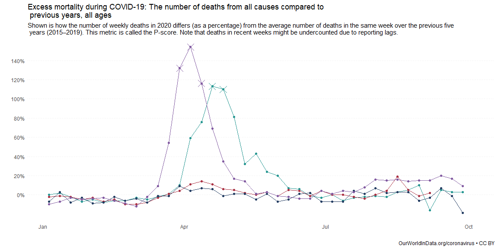
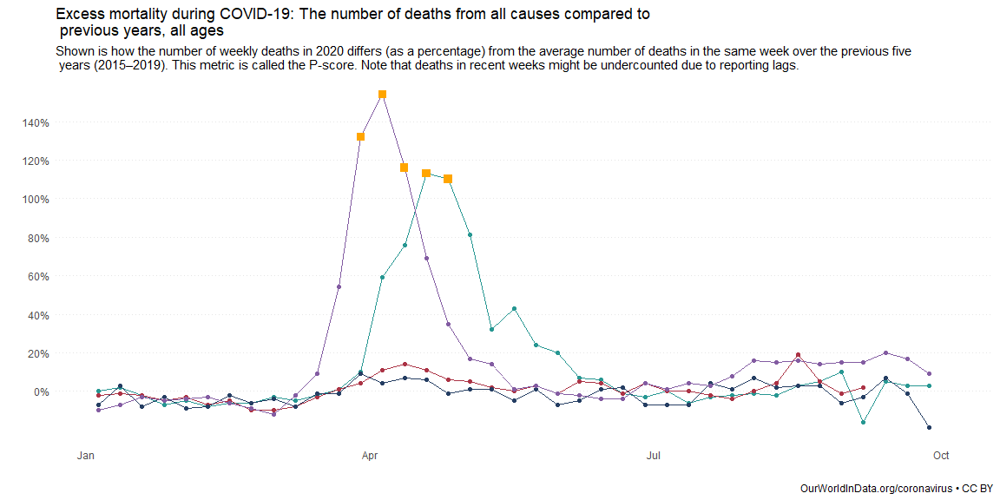
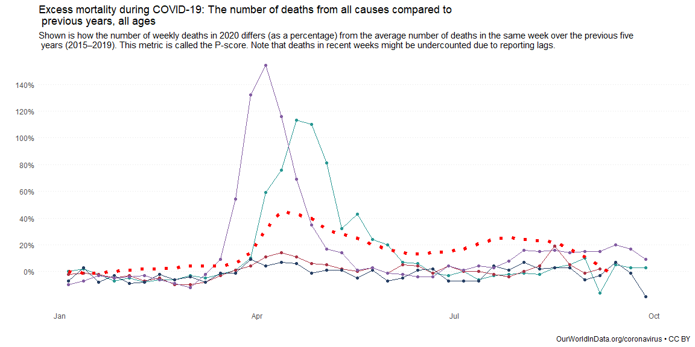
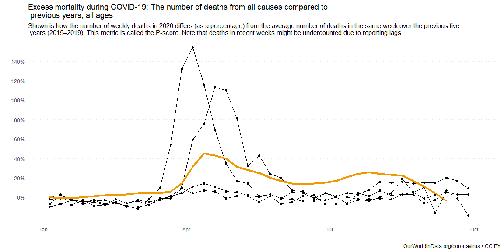

```r
# Use this R-Chunk to import all your datasets!
data <- read_csv("https://github.com/ktoutloud/classslides/raw/master/math335/data/covid19_p-scores.csv")
```

## Background

This is an attempt on a recreation of the visualization found here:
https://ourworldindata.org/grapher/excess-mortality-p-scores?tab=chart&stackMode=absolute&time=earliest..latest&region=World

## Data Wrangling


```r
# Use this R-Chunk to clean & wrangle your data!
data1 <- data %>%
  mutate(Spain = Spain * 100) %>% 
  pivot_longer(cols = -date, # this moves all of the columns except the date
               names_to = "country",
               values_to = "pscore") %>% 
  filter(country %in% c("Spain", "Germany", "Norway", "England & Wales"))

data2 <- data1 %>% 
  filter(pscore > 100)

data3 <- data %>% 
  pivot_longer(cols = -date, # this moves all of the columns except the date
               names_to = "country",
               values_to = "pscore") %>% 
  filter(country == "United States")
```

## Data Visualization


```r
# Use this R-Chunk to plot & visualize your data!
graph <- ggplot(data = data1, aes(x = date, y = pscore, color = country)) +
  geom_line() +
  
  geom_point() +
  
  scale_y_continuous(breaks = seq(0,140,20), #not sure what this does exactly
                     minor_breaks = NULL, 
                     labels = function(x)paste0(x,"%")) +
  
  # scale_x_date(limits = as.Date(c("2020-01-05","2020-09-27")),
  #              date_labels = "%b %d") +
  
  labs(title = "Excess mortality during COVID-19: The number of deaths from all causes compared to \n previous years, all ages",
       subtitle = 'Shown is how the number of weekly deaths in 2020 differs (as a percentage) from the average number of deaths in the same week over the previous five \n years (2015–2019). This metric is called the P-score. Note that deaths in recent weeks might be undercounted due to reporting lags.',
       caption = "OurWorldInData.org/coronavirus • CC BY",
       x = "",
       y = "") +
  
  theme_minimal() +
  theme(legend.position = "none",
        panel.grid = element_blank(),
        panel.grid.major.y = element_line(colour = "grey90", linetype = "dotted"),
        plot.caption = element_text(hjust = 1)) +
  
  scale_color_manual(values = c("Spain" = "#835ca2",
                                "England & Wales" = "#279792",
                                "Germany" = "#ab3345",
                                "Norway" = "#253e63")) 
```

There are pros and cons to all of the below graphs. The first two show different ways to highlight the points that are above 100%. There are multiple variations of this that can be done, I personally like the first one. The second one could use a different shape maybe to make it look a little better. The third one shows the actual values of the points and I think is the best one overall.

```r
# Highlight points over 100

#1
graph +
  geom_point(data = data2, size = 5, shape = 4)
```

<!-- -->

```r
#2
graph +
  geom_point(data = data2, size = 3, color = "orange", shape = 15)
```

<!-- -->

```r
#3
graph +
  ggrepel::geom_label_repel(data = data2, aes(label = pscore))
```

<!-- -->

The graphs below show how the United States compares to the other countries. The second one is preferred here, since it is easier to distinguish and compare.

```r
# United States Comparison
#1
graph +
  geom_line(data = data3, size = 2, linetype = "dotted", color = "red")
```

<!-- -->

```r
#2
graph +
  geom_line(data = data3, size = 1.5) +
  scale_color_manual(values = c("Spain" = "black",
                                "Norway" = "black",
                                "Germany" = "black",
                                "England & Wales" = "black",
                                "United States" = "orange2")) # Happy Halloween
```

<!-- -->


